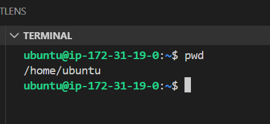
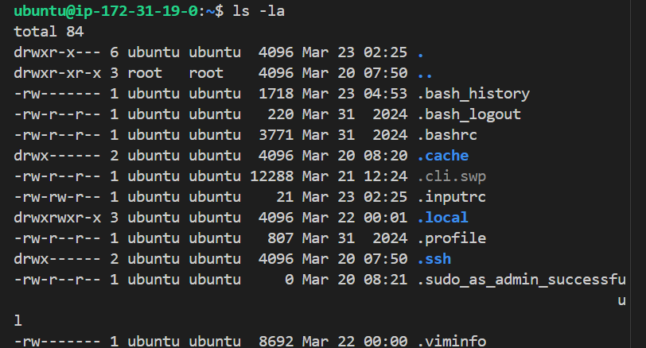
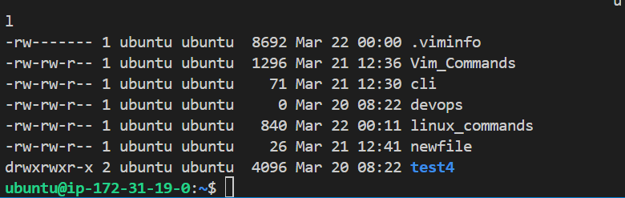
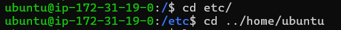

# PROJECT: LINUX AND COMMAND LINE MASTERY.

## LINUX FILE SYSTEM NAVIGATION.

TASK 1: Print the current working directory using pwd

`pwd`

TASK 2: List all files (including hidden ones) in the home directory with ls -la

`ls -la`

TASK 3: Change directories into `/etc` and list its contents.
`cd /`
`cd etc`
`ls`

TASK 4: Navigating back to home directory using relative paths.
`cd ../home/ubuntu`

